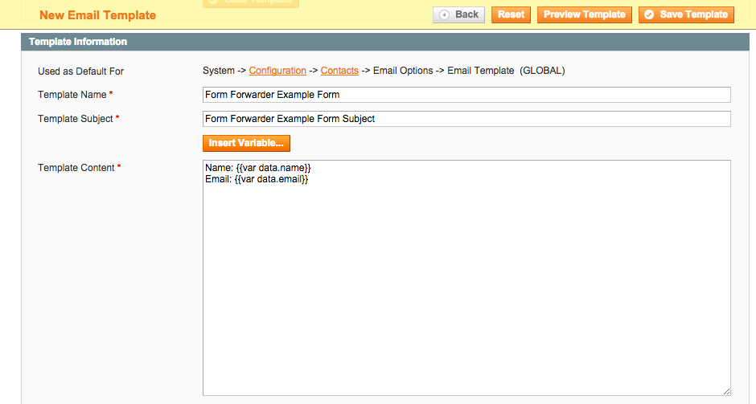

Form Forwarder
==============

Lightweight module to submit a form in a CMS page to anywhere.

Description
-----------
This is a light weight module that allows you to simply create a form in a CMS landing page. 
By adding a few hidden fields, you can then have the form submit to any email address you choose. 
File uploads are also supported, which will be emailed to the recipient as attachments.

How to use
----------

Upload the files to your website, turn off compilation, clear cache, etc. 

Create a form in a CMS page. Form method is POST and action is "formforwarder." 

Add the required hidden field *template_code* and *form_key.* Optional fields 
include *forward,* which if it is not set, will use the default Contacts email 
(in the admin under System -> Configuration -> General -> Contacts -> Email 
Options), and *redirect* which is the page to redirect to after form submission, 
such as a CMS thank you page.

```
<form id="form-forwarder-example-form" action="{{store url="formforwarder"}}" enctype="multipart/form-data" method="post">
	<div class="fieldset">
		<input type="hidden" name="form_key" value="{{block type="aydus_formforwarder/formkey"}}" />
		<input type="hidden" name="forward" value="davidt@aydus.com" /> 
		<input type="hidden" name="template_code" value="Form Forwarder Example Form" /> 
		<input type="hidden" name="redirect" value="thanks" /> 
		<input type="hidden" name="MAX_FILE_SIZE" value="25000000">

		<div>
			<label for="name">Name</label>
			<div class="input-box">
				<input type="text" name="name" class="input-text required-entry" />
			</div>
		</div>
		<div>
			<label for="email">Email</label>
			<div class="input-box">
				<input type="text" name="email" class="input-text required-entry" />
			</div>
		</div>
		<div>
			<label for="file">Photo</label>
			<div class="input-box">
				<input type="file" name="photo" />
			</div>
		</div>

		<div class="buttons-set">
			<button type="submit" title="submit" class="button">
				<span><span>Submit</span></span>
			</button>
		</div>
	</div>
</form>

<script type="text/javascript">
    //< ![CDATA[
        var formForwarderExampleForm = new VarienForm('form-forwarder-example-form');
    //]]>
</script>
```

The hidden field *template_code* is the name of the transactional email that will be used. Create the transactional email:




